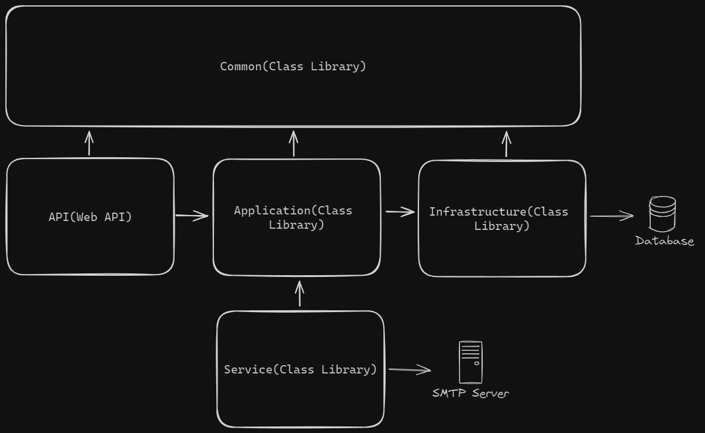

# ApiTurismo

ApiTurismo es un proyecto desarrollado para gestionar recorridos(viajes y pasajeros) e informacion de destinos(ciudades). Esta soluci�n, basada en una API RESTful, fue implementada utilizando ASP.NET Core y Entity Framework Core, aplicando los principios de arquitectura limpia.

## Arquitectura

El proyecto est� estructurado en diferentes capas y bibliotecas de clases que interact�an entre s� para manejar las funciones de la aplicaci�n. A continuaci�n, se detallan los componentes principales.



## Instalaci�n

### Requisitos basicos

- SDK .NET 8.0 o superior
- SQL Server u otro servidor compatible
- Servidor SMTP

### Pasos

1. **Clona el repositorio**:
    ```bash
    git clone https://github.com/frackfernandez/ApiTurismo.git
    cd ApiTurismo
    ```

2. **Restaura las dependencias**:
    ```bash
    dotnet restore
    ```

3. **Configura la cadena de conexi�n de la base de datos:**

    Abre el archivo `appsettings.json` en la carpeta `API` y actualiza la cadena de conexi�n.
    
4. **Configura las credenciales del servidor SMTP:**

    Abre el archivo `ServiceEmail.cs` en la carpeta `Services` y actualiza las credenciales.

5. **Aplica las migraciones y actualiza la base de datos:**

    Ejecuta el siguiente comando para aplicar las migraciones a la base de datos:

    ```bash
    dotnet ef database update --project TurismoApp.Infraestructure
    ```

    Alternativamente, si prefieres ejecutar la migraci�n manualmente en tu PC, puedes utilizar los siguientes comandos en la consola del administrador de paquetes o en la terminal de comandos:

    Crear la migraci�n:

    ```bash
    Add-Migration Inicial -Project TurismoApp.Infraestructure
    ```

    Aplicar la migraci�n a la base de datos:

    ```bash
    Update-Database -Project TurismoApp.Infraestructure

6. **Compila el proyecto**:
    ```bash
    dotnet build
    ```

## Contribuciones

Se agradecen las contribuciones. Por favor, sigue el proceso habitual en GitHub para realizar un fork, crea una rama, haz los cambios y env�a un pull request.

## Licencia

Este proyecto est� bajo la [MIT License](https://opensource.org/licenses/MIT).